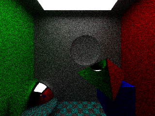
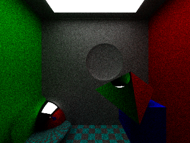
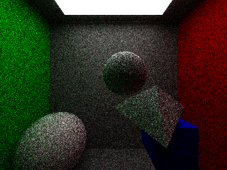

# Report

## Adv.Graphics, assignement 1

### 1. Normals

### 2. increased spp

spp: 30  

spp: 100

### All diffuse

### BVH

without: 111.32s user 0.08s system 99% cpu 1:51.87 total

with: 24.13s user 0.03s system 98% cpu 24.581 total